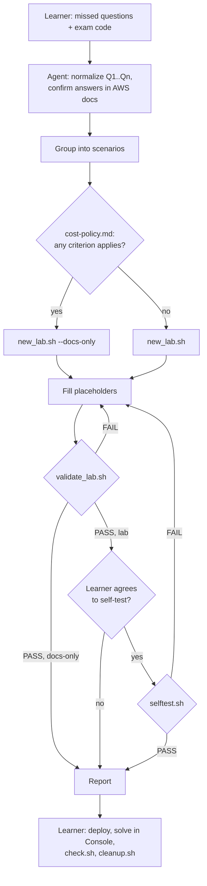
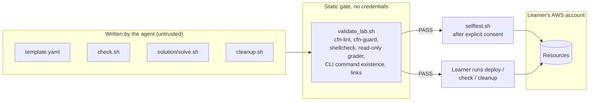

# Architecture

Wrong Answer Labs is an [Agent Skill](https://agentskills.io/specification)
packaged as a Claude Code plugin. There is no service to run: the product is a
set of instructions, templates, policy files and bash scripts that an AI
coding agent follows to turn missed AWS Certification questions into labs.

The core idea: **determinism comes from tools, not from the model's judgment**.
The agent writes the lab; `cfn-lint`, `cfn-guard`, `shellcheck`, a link
checker and a real-account self-test decide whether it is acceptable.

## Components

```
.claude-plugin/                 plugin.json (version, metadata), marketplace.json
skills/wrong-answer-labs/
  SKILL.md                      agent instructions: inputs, 9-step workflow, red flags
  references/
    lab-format.md               anatomy of a lab, anchors, grader/template rules
    cost-policy.md              lab vs docs-only decision table
  assets/
    lab/                        skeleton copied into every new lab
    docs-only/                  skeleton for documentation-only entries
  rules/
    lab-cost.guard              33 cost rules, default-deny allowlist of 176 types
    lab-security.guard          12 security baseline rules
  scripts/
    new_lab.sh                  scaffold a lab from assets/
    validate_lab.sh             static quality gate (no AWS credentials)
    selftest.sh                 end-to-end test in a real AWS account
    price.sh                    on-demand prices from the Price List API
    image_digest.sh             resolve an ECR Public tag to a digest
  examples/                     labs that pass every check (also CI fixtures)
tests/                          tooling tests (bash tests/run.sh)
evals/                          behavioral scenarios for the agent
.github/workflows/               ci.yml (tests), release.yml (release-please)
```

| Component | Consumer | Role |
|---|---|---|
| `SKILL.md` | Agent | Entry point. Loaded when the learner shares missed questions. Defines the workflow and the "red flags" the agent must not do. |
| `references/` | Agent | Loaded on demand from `SKILL.md`. Long-form rules for writing labs and choosing lab vs docs-only. |
| `assets/` | `new_lab.sh` | Skeletons with `{{PLACEHOLDER}}` markers and fixed anchors. The shared grader/cleanup helpers live here. |
| `rules/` | `validate_lab.sh`, `tests/run.sh` | cfn-guard policy. The cost/security contract of the project. |
| `scripts/` | Agent, learner, CI | Deterministic tooling. |
| `examples/` | Agent, CI | Style reference for the agent; regression fixtures for the validator. |
| `tests/` | CI | Tests the tooling itself (rules, validator, scripts). |
| `evals/` | Maintainer | Manual scenarios that test the agent's behavior with the skill. |

## End-to-end flow



See [lab-lifecycle.md](lab-lifecycle.md) for each step in detail.

## Trust boundaries

Labs run in the learner's own AWS account, and their content is written by a
model. The design treats the model's output as untrusted until tools approve it.



| Boundary | Enforcement |
|---|---|
| Agent → account while authoring | `SKILL.md` forbids any AWS write outside `selftest.sh`; facts are checked in docs, `cfn-lint` or read-only calls ([ADR 0003](decisions/0003-only-selftest-writes-to-aws.md)). |
| Template → account | `lab-cost.guard` (default deny, size caps, deletable) and `lab-security.guard` ([guardrails.md](guardrails.md)). |
| Grader → account | `validate_lab.sh` rejects any `aws` operation in `check.sh` that is not read-only. |
| Unvalidated lab → account | `selftest.sh` runs `validate_lab.sh` first and aborts on failure. |
| Self-test → existing stacks | `selftest.sh` aborts if the stack name already exists, because its cleanup trap would delete it. |
| Rules → weakened by the agent | `SKILL.md` red flags: never edit `rules/*.guard`; a lab that needs a denied type becomes docs-only ([ADR 0001](decisions/0001-default-deny-cost-gate.md)). |

What sits **outside** these boundaries is listed in
[guardrails.md → Known limits](guardrails.md#known-limits).

## Conventions that tie components together

- **Stack name**: `lab-<cert-lowercase>-<slug>`, truncated to 128 characters.
  `new_lab.sh` writes it into the README deploy command; `selftest.sh` reads it
  back from there.
- **Stack tags**: `project=exam-labs cert=<CERT> lab=<stack>`.
- **Region**: `us-east-1` by default in every script (`[region]` argument or
  `AWS_REGION` overrides it). Prices in cost tables are for `us-east-1`.
- **Lab location**: `./labs/<CERT>/<slug>/` relative to where the agent runs
  (ignored by git in this repository), or `--root <dir>`.
- **Language**: code, identifiers, file names, anchors and script output stay
  in English; lab prose follows the learner's language.
