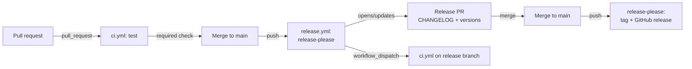

# CI/CD

There is nothing to deploy: the plugin is distributed straight from this
repository through the Claude Code plugin marketplace. "Delivery" means
tagging a version and bumping `.claude-plugin/plugin.json`, which is what makes
installed plugins update.

## `ci.yml`

Triggers: `pull_request`, and `workflow_dispatch` (used by `release.yml`).
Permissions: `contents: read`. Runner `ubuntu-24.04`, 20-minute timeout.

| Step | Command |
|---|---|
| Checkout | `actions/checkout`, pinned by commit SHA |
| cfn-lint | `pipx install cfn-lint==$CFN_LINT_VERSION` |
| cfn-guard | `cargo install cfn-guard --git ... --rev $CFN_GUARD_REV --locked` |
| Agent Skills spec | `skills-ref validate` on every `skills/*/` |
| ShellCheck | `-S warning` on skill scripts, lab assets and `tests/*.sh` |
| Tests | `bash tests/run.sh` ([testing.md](testing.md)) |

### Tool pinning

| Tool | Pin | Why |
|---|---|---|
| cfn-lint | `CFN_LINT_VERSION` (exact PyPI version) | Reproducible lint results |
| cfn-guard | `CFN_GUARD_REV` (commit SHA behind tag 3.2.1) | 3.2.1 is not on crates.io, and a SHA, unlike a tag, cannot be moved |
| skills-ref | Commit SHA in `SKILLS_REF` | Not published to PyPI |
| GitHub Actions | Commit SHA with a version comment | Tags are mutable |

Dependabot (`.github/dependabot.yml`) opens monthly PRs to bump the
SHA-pinned actions. cfn-lint, cfn-guard and skills-ref are bumped by hand in
`ci.yml`.

No AWS credentials are available in CI, so `selftest.sh` never runs there.

## `release.yml`

Trigger: `push` to `main`. Permissions: `contents: write`,
`pull-requests: write`, `actions: write`.

1. `googleapis/release-please-action` keeps a release PR open with the next
   version, the `CHANGELOG.md` entry, `.release-please-manifest.json` and the
   bumped `$.version` in `.claude-plugin/plugin.json`.
2. PRs opened with `GITHUB_TOKEN` do not trigger other workflows, but branch
   protection requires the `test` check. So when a release PR was created or
   updated, the workflow reads its head branch from the action output and runs
   `gh workflow run ci.yml --ref <branch>`. If the output carries no PR (it can
   after a release is published), the step exits cleanly.
3. Merging the release PR makes release-please tag the version and publish the
   GitHub release.

Configuration: `release-please-config.json` (`release-type: simple`,
`bump-minor-pre-major: true`, no component in tags).

### Versioning

Driven by [Conventional Commits](https://www.conventionalcommits.org/en/v1.0.0/):

| Commit type | Next version while below 1.0 |
|---|---|
| `fix:` | patch |
| `feat:` | minor |
| `feat!:` / `BREAKING CHANGE:` | minor (`bump-minor-pre-major`) |
| `docs:`, `test:`, `ci:`, `chore:` | no release on their own |

Never edit the version in `plugin.json` by hand
([ADR 0005](decisions/0005-automated-releases.md)).

## Repository settings this depends on

- Branch protection on `main` requiring the `test` check.
- GitHub private vulnerability reporting enabled (linked from
  `.github/ISSUE_TEMPLATE/config.yml` and `SECURITY.md`).
- Issue templates: `lab-came-out-wrong`, `resource-type-request`,
  `tooling-bug`; blank issues disabled.
