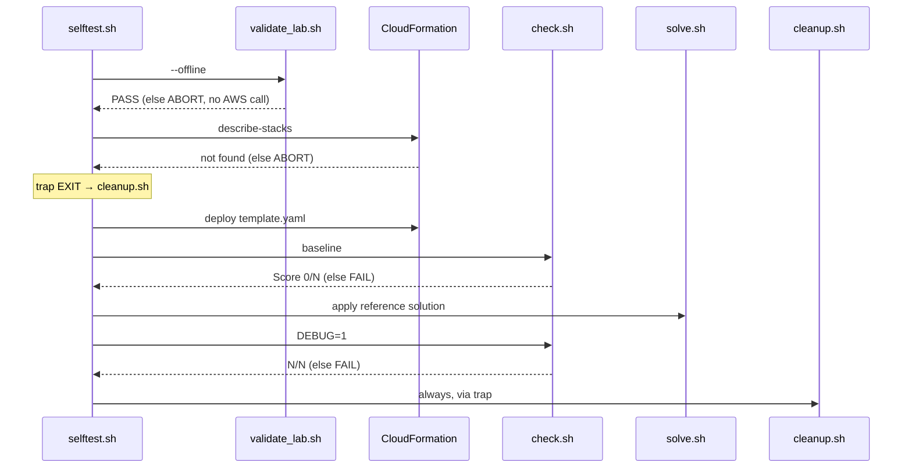

# Lab lifecycle

A lab goes through two phases: the agent **authors** it, then the learner
**uses** it. This page walks both and explains every file a lab contains. The
normative rules are in [`SKILL.md`](../skills/wrong-answer-labs/SKILL.md) and
[`references/lab-format.md`](../skills/wrong-answer-labs/references/lab-format.md).

## Output types

| Type | When | Files |
|---|---|---|
| **Lab** | The topic can be reproduced cheaply in one account | `README.md`, `template.yaml`, `check.sh`, `cleanup.sh`, `solution/README.md`, `solution/solve.sh` |
| **Docs-only entry** | Any criterion in [`cost-policy.md`](../skills/wrong-answer-labs/references/cost-policy.md) applies | `README.md` only |

`validate_lab.sh` tells them apart by the presence of `template.yaml`.

### Docs-only criteria (summary)

| # | Criterion | Example |
|---|---|---|
| 1 | Physical hardware, on-premises gear or a partner/carrier | Direct Connect, Outposts, Snow Family |
| 2 | Commitment, subscription or non-prorated fee | Shield Advanced, Savings Plans, domain registration |
| 3 | > US$0.50/hour or > US$1.00 for the whole lab | Redshift provisioned, MSK, FSx |
| 4 | Organizations management account, root, or hard-to-undo account change | SCPs, Control Tower |
| 5 | Deploy + delete > 30 min | Managed Microsoft AD |
| 6 | A second account or a principal the learner does not control | Cross-account snapshot sharing |

Rows 2–3 are also enforced mechanically by `lab-cost.guard`. A lab that only
passes the guard by dropping the tested concept is docs-only too.

## Authoring (agent)

| Step | What happens | Tool / file |
|---|---|---|
| 1. Normalize | Each question becomes `Qn`: concept, services, learner's answer, correct answer. Missing answers are derived and confirmed in official AWS docs (an AWS MCP server's documentation tools when connected, such as the Agent Toolkit for AWS's AWS MCP Server or `awslabs.aws-documentation-mcp-server`, else docs.aws.amazon.com). No confirming doc → `⚠️ unverified`. | — |
| 2. Map domains | Match each question to the official exam guide domains. | Exam guide index |
| 3. Split into scenarios | One lab per realistic scenario, 1–5 challenges, ≤ 90 min. Related questions share a lab; unrelated ones never do. | — |
| 4. Lab vs docs-only | Apply the criteria above. | `cost-policy.md` |
| 5. Scaffold | Copy the skeleton, substitute `{{CERT}}` and `{{STACK_NAME}}`. | `new_lab.sh` |
| 6. Fill | Replace every `{{PLACEHOLDER}}`. Prices come from `price.sh`, image digests from `image_digest.sh`. | `lab-format.md` |
| 7. Gate | Loop until `PASS`. Fix the lab, never the rules. | `validate_lab.sh` |
| 8. Self-test | Labs only. Recommended for every lab, run only after the learner agrees (it creates billable resources). Must end in `SELFTEST PASS`. | `selftest.sh` |
| 9. Report | One row per entry: questions covered, estimated cost, validator result, self-test result or why not run. | — |

### Red flags

`SKILL.md` lists temptations the agent must resist. The ones that protect the
account:

- editing `rules/*.guard` or adding suppressions to make a template pass;
- custom resources or Lambda functions that create resources;
- any AWS write while authoring ("just a quick probe");
- AWS MCP server tools beyond documentation and read-only calls (`call_aws` writes, `run_script`, change sets, pre-deployment validation);
- parameterized instance types or sizes (the guard can only validate literals);
- prices or doc URLs from memory.

The ones that protect the learning value:

- challenge text that names the feature that answers it;
- a check that passes right after deploy (the template solved the challenge);
- handwritten apps, images or data when something maintained exists.

## Lab files

### `README.md` — what the learner reads

Sections are identified by anchors, not headings, so the prose can be in any
language ([ADR 0002](decisions/0002-anchor-based-lab-structure.md)).

| Anchor | Content |
|---|---|
| `section:scenario` | 3–6 sentences: fictional company, what went wrong, the constraint from the missed question |
| `section:objectives` | What the learner will demonstrate |
| `section:before-you-start` | Account, CloudShell, region, deploy time |
| `section:cost` | Cost table: one row per billable resource, `us-east-1` price, lab cost, official pricing URL |
| `section:deploy` | `aws cloudformation deploy` command with the stack name and tags |
| `section:challenges` | One `challenge:N` block per challenge (N = 1..5): outcome + acceptance criteria, never the solution |
| `section:verify` | `bash check.sh <stack>` |
| `section:cleanup` | `bash cleanup.sh <stack>` |
| `section:references` | Official documentation links (all checked by the validator) |

### `template.yaml` — starting environment

- Provisions the starting state only; must not satisfy any criterion
  (`selftest.sh` enforces a 0/N baseline).
- No hardcoded account IDs, regions, AZs or AMI IDs (pseudo parameters,
  `!GetAZs`, SSM public parameters).
- Generated physical names; anything the learner needs is a stack **Output**.
- Only allowlisted types with literal sizes; security baseline applies.
- Everything deletable by `delete-stack`.
- Deploy time ≤ 15 min.

### `check.sh` — grader

Built on a shared harness from `assets/lab/check.sh`:

```bash
check <challenge-number> "<description>" "<expected stdout>" <command...>
```

A check passes when the command's stdout equals the expected value exactly;
a failing command yields `<error>`. Helpers `stack_output <key>` and
`stack_resource <logical-id>` resolve stack resources. `DEBUG=1` prints
expected vs actual. Output ends in `Score: P/T`; exit code is 0 only when
every check passes, 2 when the stack does not exist.

Rules the validator enforces or the self-test proves:

- read-only AWS operations only (see [guardrails.md](guardrails.md#grader-is-read-only));
- every challenge has at least one `check N` line, and no check references a
  missing challenge;
- every check fails on a fresh deploy and passes after `solve.sh`.

Checks grade the resulting configuration, not the path taken. A grader can
compute its expected value (the DVA-C02 example compares the queue visibility
timeout against six times the function's *current* timeout).

### `cleanup.sh` — teardown

Idempotently deletes resources the learner created by name during challenges
(`{{CHALLENGE_CLEANUP}}`), empties every stack S3 bucket (all versions and
delete markers), then deletes the stack and waits for completion.

### `solution/README.md` and `solution/solve.sh`

- `solution:N` per challenge: Console steps, CLI equivalent, and why.
- `question:Qn` per source question: learner's answer, correct answer, why each
  wrong option is wrong, doc link proving it.
- `solve.sh` applies the reference solution through the CLI; `selftest.sh`
  runs it. Calls that can race eventual consistency (new IAM role, web ACL,
  KMS grant) retry for minutes and fail loudly; errors are never discarded.

### Docs-only `README.md`

Anchors: `why-no-lab` (criterion + evidence), `concepts`, `references`,
`cheap-practice` (nearest honest low-cost practice, or "none"), `answers`
(one `question:Qn` block per question).

## Self-test

`selftest.sh <lab-dir> [region]` proves a lab works in a real account:



It needs AWS credentials with permission to create the lab's resources and
costs cents. CI has no AWS account, so contributors paste the self-test output
into their pull request.

## Learner flow

1. Open the lab's `README.md`; deploy (in CloudShell or locally with AWS CLI v2 and `jq`).
2. Solve the challenges in the Console.
3. `bash check.sh <stack>` until every item is ✅.
4. `solution/README.md` if stuck.
5. `bash cleanup.sh <stack>`.

Examples of each output type live in
[`skills/wrong-answer-labs/examples/`](../skills/wrong-answer-labs/examples/):

| Example | Shows |
|---|---|
| `SAA-C03/s3-accidental-delete` | Minimal lab (versioning + lifecycle) |
| `DVA-C02/sqs-lambda-retries` | Three grouped questions, computed expected values |
| `SAA-C03/direct-connect-resiliency` | Docs-only entry (criterion 1) |
